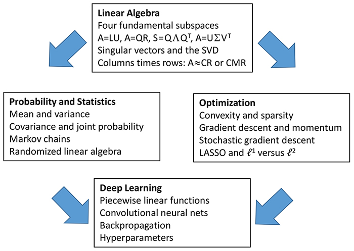

<!-- omit in toc -->
# Matrix Methods in Data Analysis, Signal Processing, and Machine Learning

<!-- omit in toc -->
## 课程信息

- 资源: [MIT 18.065](https://ocw.mit.edu/courses/mathematics/18-065-matrix-methods-in-data-analysis-signal-processing-and-machine-learning-spring-2018/index.htm
)
- 教师: [Prof. Gilbert Strang](http://math.mit.edu/~gs/)
- 视频: [YouTube](https://www.youtube.com/watch?v=t36jZG07MYc)
- 教材: [教材](http://math.mit.edu/~gs/learningfromdata/)
- 习题: [习题](Assignments%20problem%20sets/MIT18_065S18PSets.pdf)
- 答案: [答案](Assignments%20problem%20sets/Solutions%20to%20Exercises.pdf)
- 介绍:
  - Linear algebra concepts are key for understanding and creating machine learning algorithms, especially as applied to deep learning and neural networks. This course reviews linear algebra with applications to probability and statistics and optimization–and above all a full explanation of deep learning.
- 参考书:
  - [Trefethen, Bau - Numerical Linear Algebra](https://github.com/CvierXi/Study/blob/master/01_OpenCourse/MIT/18.065_Matrix%20Methods%20in%20Data%20Analysis%2C%20Signal%20Processing%2C%20and%20Machine%20Learning/Reference%20Books/Trefethen%2C%20Bau%20-%20Numerical%20Linear%20Algebra.pdf)
  - [Golub, VanLoan - Matrix Computations](https://github.com/CvierXi/Study/blob/master/01_OpenCourse/MIT/18.065_Matrix%20Methods%20in%20Data%20Analysis%2C%20Signal%20Processing%2C%20and%20Machine%20Learning/Reference%20Books/Golub%2C%20VanLoan%20-%20Matrix%20Computations.pdf)
- 其他:
  - Chrome浏览器需要安装[MathJax Plugin for Github](https://chrome.google.com/webstore/detail/mathjax-plugin-for-github/ioemnmodlmafdkllaclgeombjnmnbima/related)插件以正确显示公式.  

<!-- omit in toc -->
## 视频课程

- [00.1_课程简介](#001_课程简介)
- [00.2_采访](#002_采访)
- [01_矩阵列空间](#01_矩阵列空间)
- [02_矩阵相乘和分解](#02_矩阵相乘和分解)
- [03_正交矩阵](#03_正交矩阵)
- [04_特征值和特征向量](#04_特征值和特征向量)
- [05_正定和半正定矩阵](#05_正定和半正定矩阵)
- [06_奇异值分解SVD](#06_奇异值分解SVD)
- [07_$A$的最邻近秩$k$矩阵](#07_$A$的最邻近秩$k$矩阵)
- [08_向量和矩阵的范数](#08_向量和矩阵的范数)
- [09_最小二乘法的四种解法](#09_最小二乘法的四种解法)
- [10_$Ax=b$](#10_$Ax=b$)
- [11_最小化$\lVert x \rVert$，使得$Ax=b$](#11%e6%9c%80%e5%b0%8f%e5%8c%96lvert-x-rvert%e4%bd%bf%e5%be%97axb)
- [12_计算特征值和奇异值](#12_计算特征值和奇异值)
- [13_矩阵相乘的随机抽样](#13%e7%9f%a9%e9%98%b5%e7%9b%b8%e4%b9%98%e7%9a%84%e9%9a%8f%e6%9c%ba%e6%8a%bd%e6%a0%b7)

### 00.1_课程简介

- <https://www.bilibili.com/video/BV1dg4y187Y8?p=1>

### 00.2_采访

- <https://www.bilibili.com/video/BV1dg4y187Y8?p=2>

### 01_矩阵列空间

- <https://www.bilibili.com/video/BV1dg4y187Y8?p=3>
- Description
  - In this first lecture, Professor Strang introduces the linear algebra principles critical for understanding the content of the course.  In particular, matrix-vector multiplication $Ax$ and the column space of a matrix and the rank.
- Summary
  - Independent columns = basis for the column space
  - Rank = number of independent columns
  - $A=CR$ leads to: Row rank equals column rank

### 02_矩阵相乘和分解

- <https://www.bilibili.com/video/BV1dg4y187Y8?p=4>
- Description
  - Multiplying and factoring matrices are the topics of this lecture. Professor Strang reviews multiplying columns by rows:  $AB=$ sum of rank one matrices. He also introduces the five most important factorizations.
- Summary
  - Multiplying columns by rows:  $AB=$ sum of rank one matrices
  - Five great factorizations:
    - $A=LU$ from elimination
    - $A=QR$ from orthogonalization (Gram-Schmidt)
    - $S=Q\Lambda Q^T$ from eigenvectors of a symmetric matrix $S$
    - $A=X\Lambda X^{-1}$ diagonalizes $A$ by the eigenvector matrix $X$
    - $A=U\Sigma V^T=$ (orthogonal)(diagonal)(orthogonal) = Singular Value Decomposition
- Related section in textbook: I.2
  - $A=CR$ leads to: Row rank equals column rank

### 03_正交矩阵

- <https://www.bilibili.com/video/BV1dg4y187Y8?p=5>
- Description
  - This lecture focuses on orthogonal matrices and subspaces. Professor Strang reviews the four fundamental subspaces: column space $C(A)$, row space $C(A^T)$, nullspace $N(A)$, left nullspace $N(A^T)$.
- Summary
  - Rotations
  - Reflections
  - Hadamard matrices
  - Haar wavelets
  - Discrete Fourier Transform (DFT)
  - Complex inner product
- Related section in textbook: I.5

### 04_特征值和特征向量

- <https://www.bilibili.com/video/BV1dg4y187Y8?p=6>
- Description
  - Professor Strang begins this lecture talking about eigenvectors and eigenvalues and why they are useful. Then he moves to a discussion of symmetric matrices, in particular, positive definite matrices.
- Summary
  - $Ax=\lambda x$
  - $A^2x=\lambda^2 x$
  - Write other vectors as combinations of eigenvectors
  - Similar matrix $B=M^{-1}AM$ has the same eigenvalues as $A$
- Related section in textbook: I.6

### 05_正定和半正定矩阵

- <https://www.bilibili.com/video/BV1dg4y187Y8?p=7>
- Description
  - In this lecture, Professor Strang continues reviewing key matrices, such as positive definite and semidefinite matrices. This lecture concludes his review of the highlights of linear algebra.
- Summary
  - All $\lambda_i>0$
  - Energy $x^TSx>0$
  - $S=A^TA$ (independent cols in $A$)
  - All leading determinants $>0$
  - All pivots in elimination $>0$
- Related section in textbook: I.7

### 06_奇异值分解SVD

- <https://www.bilibili.com/video/BV1dg4y187Y8?p=8>
- Description
  - Singular Value Decomposition (SVD) is the primary topic of this lecture. Professor Strang explains and illustrates how the SVD separates a matrix into rank one pieces, and that those pieces come in order of importance.
- Summary
  - $A=U\Sigma V^T$
  - Columns of $V$ are orthonormal eigenvectors of $A^TA$.
  - $Av=\sigma u$ gives orthonormal eigenvectors $u$ of $AA^T$.
  - $\sigma^2=$ eigenvalue of $A^TA$ = eigenvalue of $AA^T\neq0$
  - $A$ = (rotation)(stretching)(rotation) $U\Sigma V^T$ for every $A$
- Related section in textbook: I.8

### 07_$A$的最邻近秩$k$矩阵

- <https://www.bilibili.com/video/BV1dg4y187Y8?p=9>
- Description
  - A norm is a way to measure the size of a vector, a matrix, a tensor, or a function. Professor Strang reviews a variety of norms that are important to understand including S-norms, the nuclear norm, and the Frobenius norm.
- Summary
  - $A_k=\sigma_1u_1v^T_1+\cdots+\sigma_ku_kv^T_k$
  - $\lVert A-B_k \rVert \geq \lVert A-A_k \rVert$
  - Norms
    - ${\lVert v \rVert}_1 = \lvert v_1 \rvert + \cdots + \lvert v_n \rvert$
    - ${\lVert v \rVert}_2 = \sqrt{{\lvert v_1 \rvert}^2 + \cdots + {\lvert v_1 \rvert}^2}$
    - ${\lVert v \rVert}_{\infty} = \max {\lvert v_i \rvert}$
    - ${\lVert A \rVert}_{Nuclear} = \sigma_1 + \cdots + \sigma_r$
    - ${\lVert A \rVert}_{Frobenius} = \sqrt{{\lvert a_{11} \rvert}^2 + {\lvert a_{12} \rvert}^2 + \cdots + {\lvert a_{mn} \rvert}^2}$
    - ${\lVert A \rVert}_2 = \sigma_1$
  - The idea of Principal Component Analysis (PCA)
- Related section in textbook: I.9

### 08_向量和矩阵的范数

- <https://www.bilibili.com/video/BV1dg4y187Y8?p=10>
- Description
  - In this lecture, Professor Strang reviews Principal Component Analysis (PCA), which is a major tool in understanding a matrix of data. In particular, he focuses on the Eckart-Young low rank approximation theorem.
- Summary
  - ${\lVert v \rVert}_1 = \lvert v_1 \rvert + \cdots + \lvert v_n \rvert$
  - ${\lVert v \rVert}_2 = \sqrt{{\lvert v_1 \rvert}^2 + \cdots + {\lvert v_1 \rvert}^2}$
  - ${\lVert v \rVert}_{\infty} = \max {\lvert v_i \rvert}$
  - ${\lVert A \rVert}_{Nuclear} = \sigma_1 + \cdots + \sigma_r$
  - ${\lVert A \rVert}_{Frobenius} = \sqrt{{\lvert a_{11} \rvert}^2 + {\lvert a_{12} \rvert}^2 + \cdots + {\lvert a_{mn} \rvert}^2}$
  - ${\lVert A \rVert}_2 = \sigma_1$
- Related section in textbook: I.11

### 09_最小二乘法的四种解法

- <https://www.bilibili.com/video/BV1dg4y187Y8?p=11>
- Description
  - In this lecture, Professor Strang details the four ways to solve least-squares problems. Solving least-squares problems comes in to play in the many applications that rely on data fitting.
- Summary
  - Solve $A^TA\hat{x}=A^Tb$ to minimize $\lVert Ax-b \rVert ^2$
  - Gram-Schmidt $A=QR$ leads to $x=R^{-1}Q^Tb$
  - The pseudoinverse directly multiplies $b$ to give $x$
  - The best $x$ is the limit of $(A^TA+\delta I)^{-1}A^Tb$ as $\delta \rightarrow 0$.
- Related section in textbook: II.2

### 10_$Ax=b$

- <https://www.bilibili.com/video/BV1dg4y187Y8?p=12>
- Description
  - The subject of this lecture is the matrix equation $Ax=b$. Solving for $x$ presents a number of challenges that must be addressed when doing computations with large matrices.
- Summary
  - Large condition number $\lVert A \rVert$ $\lVert A^{-1} \rVert$
  - $A$ is ill-conditioned and small errors are amplified.
  - Penalty method regularizes a singular problem.
- Related chapter in textbook: Introduction to Chapter II

### 11_最小化$\lVert x \rVert$，使得$Ax=b$

- <https://www.bilibili.com/video/BV1dg4y187Y8?p=13>
- Description
  - In this lecture, Professor Strang revisits the ways to solve least squares problems. In particular, he focuses on the Gram-Schmidt process that finds orthogonal vectors.
- Summary
  - Picture the shortest $x$ in $\ell^1$ and $\ell^2$ and $\ell^{\infty}$ norms
  - The $\ell^1$ norm gives a sparse solution $x$.
  - Details of Gram-Schmidt orthogonalization and $A=QR$
  - Orthogonal vectors in $Q$ from independent vectors in $A$
- Related chapter in textbook: Introduction to Chapter I.11

### 12_计算特征值和奇异值

- <https://www.bilibili.com/video/BV1dg4y187Y8?p=14>
- Description
  - Numerical linear algebra is the subject of this lecture and, in particular, how to compute eigenvalues and singular values. This includes discussion of the Hessenberg matrix, a square matrix that is almost (except for one extra diagonal) triangular.
- Summary
  - $QR$ method for eigenvalues: Reverse $A=QR$ to $A_1=RQ$
  - Then reverse $A_1=Q_1R_1$ to $A_2=R_1Q_1$: Include shifts
  - $A$'s become triangular with eigenvalues on the diagonal.
  - Krylov spaces and Krylov iterations
- Related chapter in textbook: Introduction to Chapter II.1

### 13_矩阵相乘的随机抽样

- <https://www.bilibili.com/video/BV1dg4y187Y8?p=15>
- Description
  - This lecture focuses on randomized linear algebra, specifically on randomized matrix multiplication. This process is useful when working with very large matrices. Professor Strang introduces and describes the basic steps of randomized computations.
- Summary
  - Sample a few columns of $A$ and rows of $B$
  - Use probabilities proportional to lengths $\lVert A_i \rVert$ $\lVert B_i \rVert$
  - See the key ideas of probability: Mean and Variance
  - Mean $=AB$ (correct) and variance to be minimized
- Related chapter in textbook: Introduction to Chapter II.4
